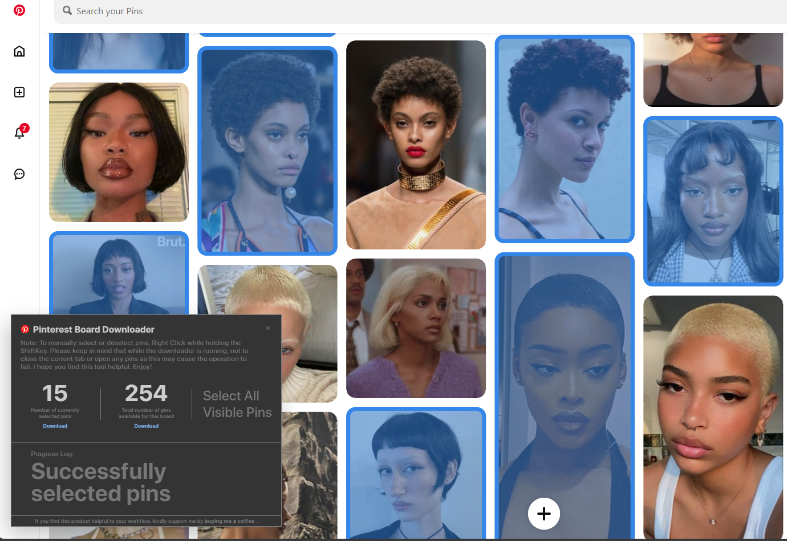

# Pinterest Board & Pin Downloader Extension

## 

## What's New (v1.1 - July 20, 2025)

**Best Image Quality**: Get the highest resolution images available, even if they're not immediately visible on the page. Enjoy crisp, clear downloads every time.

- **Skip Already Downloaded Pins**: Save time and avoid duplicates. The extension now skips pins you've already downloaded, this is very useful for growing boards and avoids re-downloading old pins (enabled by default, toggle it in the interface).
- **Download in Batches**: Experience smoother performance with downloads now processed in smaller batches (up to 10 pins at a time).

---

## What's Fixed

- **Multiple Downloads**: Resolved an issue preventing multiple downloads on Arc and Chrome browsers, thanks to @Gintasz. (See [Issue \#3245405803](https://github.com/rrokutaro/pinterest-board-downloader/pull/2#issue-3245405803))
- **Pin Selection**: Fixed problems where some pins weren't selecting correctly or were showing low-quality images.
- **Memory Usage**: Improved memory management during long downloads by clearing old pins, preventing slowdowns.

---

## Features

This extension simplifies downloading images from Pinterest with powerful, user-friendly features:

- **Individual Pin Selection**: Hover over any pin to select it and add it to your download queue.
- **Select All Visible Pins**: Quickly grab all pins currently displayed on your screen.
- **Download Entire Boards**: Easily download all pins from any Pinterest board you're viewing.
- **Image Downloads Only**: Focuses solely on downloading images, providing a fast and efficient solution.

---

## How to Install (Chrome & Edge)

Get started in just a few steps:

1.  **Download the latest release**: Grab the `.zip` file from the [releases page](https://github.com/rrokutaro/pinterest-board-downloader/releases).
2.  **Extract the file**: Unzip the downloaded file to a convenient location on your computer (should be named "browser-extension")
3.  **Open Extensions**:
    - **Chrome**: Go to `chrome://extensions/`
    - **Microsoft Edge**: Go to `edge://extensions`
4.  **Enable Developer Mode**: Toggle on **Developer mode** in the top right corner.
5.  **Load Unpacked**: Click on **Load unpacked** and select the folder you extracted in step 2.
6.  **Start Downloading**: Navigate to Pinterest and begin downloading your favorite pins\!

---

## How to Use the Extension

### Download All Board Pins

To download every pin on a Pinterest board, simply click the second download button (the one in the middle) in the extension interface.

 

### Download Specific Pins

Want to pick and choose? Here's how:

- **Select/Deselect Pins**: Hold down the `ShiftKey` + `rightClick` on any pin to select it. Right-clicking again (while holding shift) will deselect it.
- **Download Selected**: Once you've selected your pins, click the first download button.
- **Select All Visible**: Use the "Select All Visible Pins" button to bulk select currently visible pins
