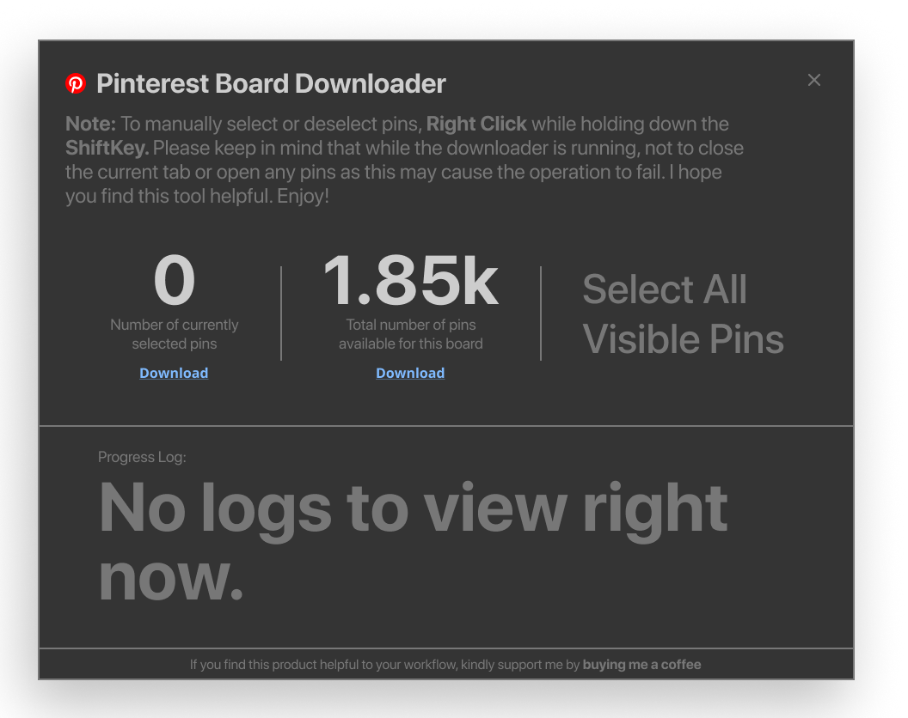
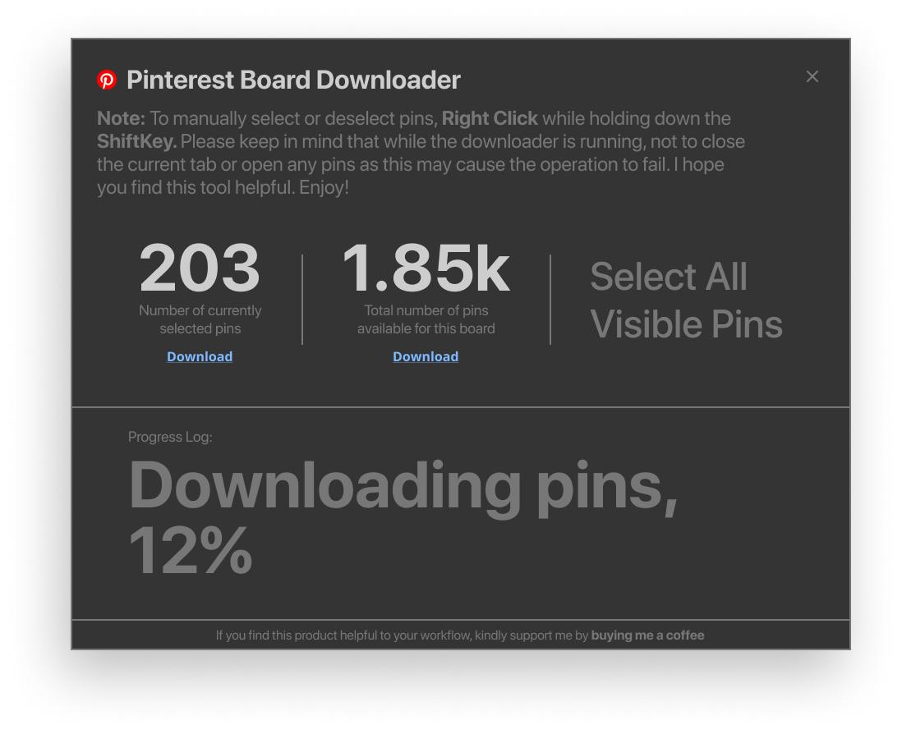
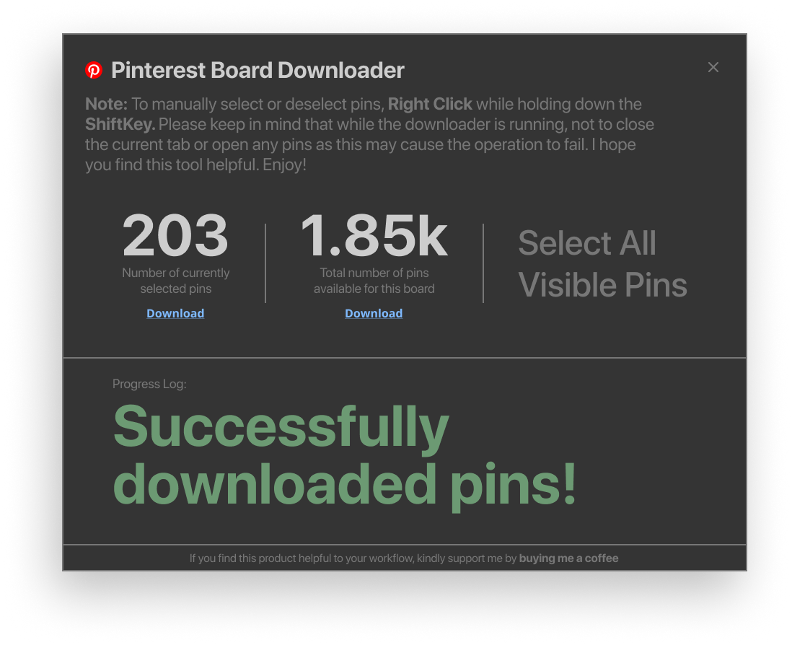
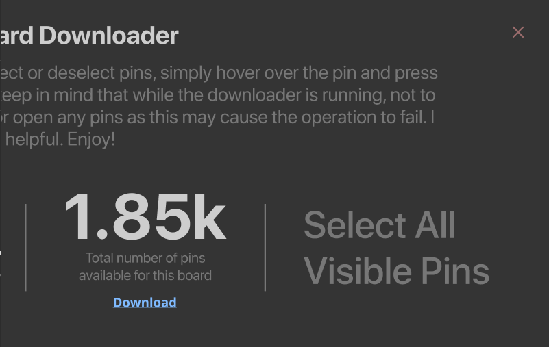
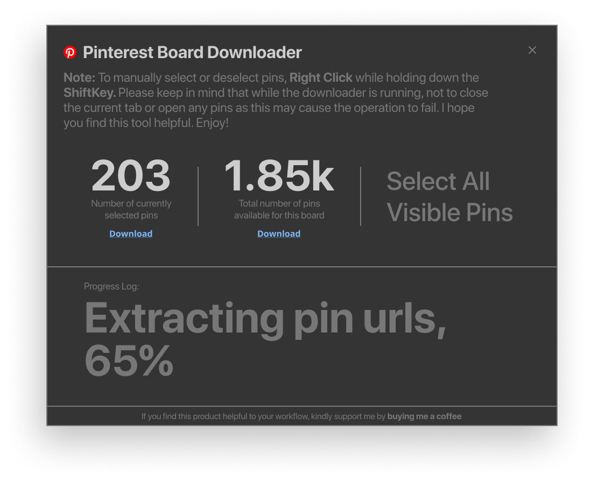
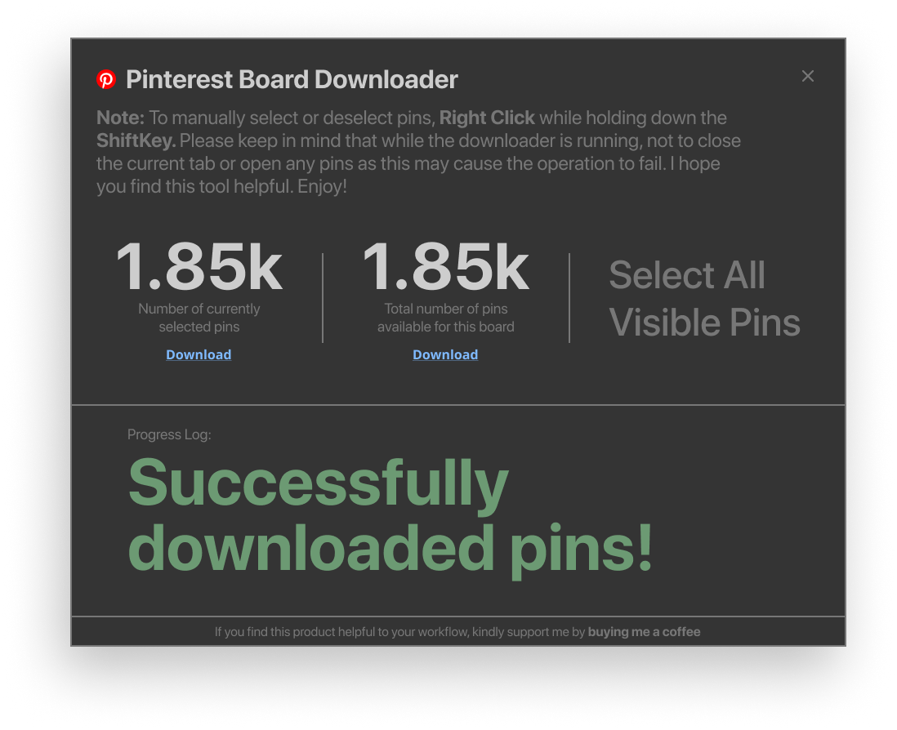

### Pinterest Board Downloader Extension

Features:

- Users can hover over any pin, select it, and add it to a queue of selected pins to be downloaded
- Users can select all currently visible pins
- Mainly, users can download all pins within a pinterest board (assuming that they are on a pinterest board page).
- Image downloads only (no videos)
- A Fast and simple Pinterest Downloader
   

### How to install the Extension (Chrome & Edge only)

1. Download the "browser extension" folder (click on the green code button at the top right, a dropdown will appear, then click "Download Zip" 
2. Extract the zip file.
3. In the url bar, enter the following: For Google Chrome enter `chrome://extensions/` or `edge://extensions` for MicroSoft Edge
4. Enable **Developer mode**.
5. Click **Load unpacked**, a pop up will appear, then select the "browser extension" that you just downloaded
6. Go to Pinterest and the extension will now be working.
    

### Task A: Select pins and download

User enables the pinterest board downloader by clicking on the button

 

The popup will then show up fully

 

While hovering over a pin, the user holds down the `ShiftKey` + `Right Click` which selects the pin, selecting the pin again unselects it.

 

User clicks the download button for currently selected pins and the download process begins.

Once the download process is complete, the appropriate feedback message is shown.

 

Finally, user closes the downloader. Upon closing, selected pins are removed, and will no longer be highlighted. Re-opening the ui would mean a new session (old pins are not remembered).

 

---

 

### Task B: Download All Board Pins

User enables the Pinterest Board Downloader

 

Clicks the 2nd download button that will first extract all pins until the number of extracted pins is equal to the specified number of board pins.

Finally, user receives a successful download response.

 

Finally, user closes the downloader. Upon closing, selected pins are removed, and will no longer be highlighted. Re-opening the ui would mean a new session (old pins are not remembered).

 
